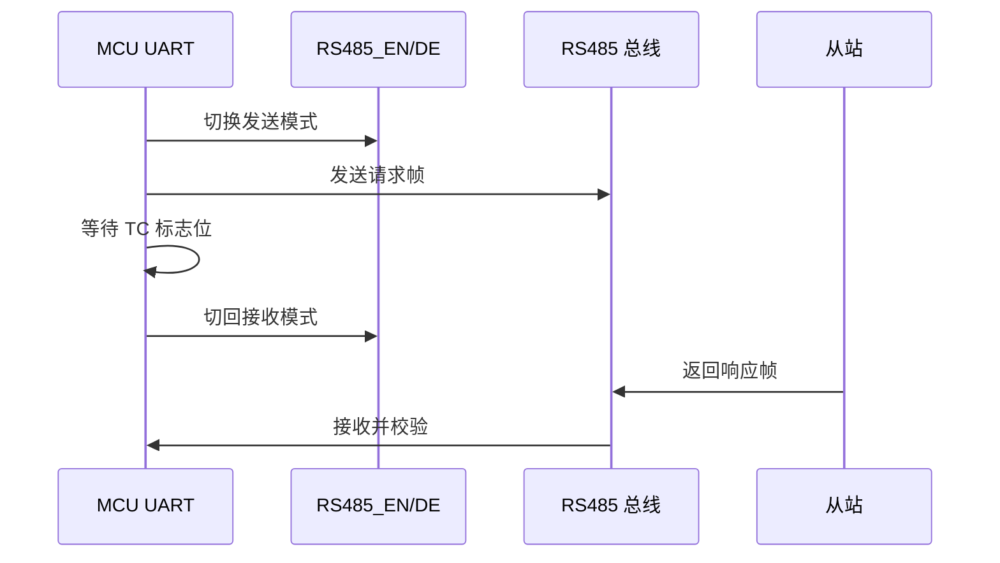

# RS485 半双工和方向控制

## 1. 本节要解决什么问题

RS485 通信里最容易让初学者卡住的问题，不是 CRC，也不是 Modbus 帧格式，而是“明明 UART 已经发送了，为什么总线上没有正确响应”。

本节要解决的问题是：

- 什么是 RS485 半双工；
- 为什么需要 RS485_EN、DE、RE 控制方向；
- 为什么发送前要切换发送模式；
- 为什么发送完成后要等待 TC 标志位；
- 为什么不能刚写完最后一个字节就立刻切回接收；
- 方向切换太早和太晚分别会造成什么问题。

这部分面试很常问，因为它能看出你是不是真的调过 RS485，而不是只会写串口发送函数。

## 2. 基本概念

RS485 常见工作方式是半双工。半双工的意思是：同一条总线上，同一时刻通常只允许一个节点发送，其他节点接收。它不像全双工 UART 那样 TX 和 RX 可以同时独立传输。

常见 RS485 收发器有方向控制相关引脚：

| 引脚/信号 | 常见含义 | 工程作用 | 注意事项 |
| --- | --- | --- | --- |
| DE | Driver Enable，发送驱动使能 | 让芯片把 UART TX 转成 RS485 差分输出 | 有效电平以芯片手册为准 |
| RE | Receiver Enable，接收使能 | 控制芯片是否接收总线数据 | 很多芯片是低有效 |
| RS485_EN | MCU 上自定义的方向控制 GPIO | 常同时控制 DE 和 RE | 名字由原理图决定，不是固定标准 |
| TC | Transmission Complete，发送完成标志 | 表示最后一个字节已经真正移出 | 比 TXE 更适合用于切回接收 |

具体引脚名称、电平有效性、DE/RE 是否短接、是否自动方向控制，都必须以对应芯片手册、模块手册、原理图和实测结果为准，不能凭经验猜。

## 3. 为什么嵌入式项目需要它

以 Modbus RTU 主站读取从站为例：

1. 主站准备请求帧；
2. 主站拉高或拉低 RS485_EN，切到发送模式；
3. UART 逐字节发送请求；
4. 等待 TC 标志位，确认最后一个停止位也发送完成；
5. 主站切回接收模式；
6. 从站收到请求后返回响应；
7. 主站接收响应并校验 CRC。

为什么不能“写完最后一个字节就切回接收”？因为写入 UART 数据寄存器，只表示 CPU 把字节交给串口外设了，不代表这个字节已经从 TX 引脚完整发完。最后一个字节还要经历起始位、数据位、校验位、停止位的发送过程。

如果你过早切回接收，最后一个字节可能被截断；如果你太晚切回接收，从站的响应前几个字节可能已经来了，但你的收发器还在发送模式，结果接收不到。

所以方向切换太早会丢请求帧尾部，方向切换太晚会丢响应帧开头。

## 4. 工程使用场景

| 场景 | 方向控制重点 | 典型故障 |
| --- | --- | --- |
| MCU 做 Modbus 主站 | 请求前切发送，请求后切接收 | 从站无响应、响应丢首字节 |
| MCU 做 Modbus 从站 | 收到请求后再切发送响应 | 主站收到异常短帧 |
| Qt + USB-RS485 调试 | 有些模块自动方向控制 | 软件没问题但模块时序不稳 |
| 多从站总线 | 任何时刻只能一个节点发送 | 多节点同时发送导致总线冲突 |

实际接线时，要确认 A/B 线、终端电阻、屏蔽层、共地方式和端子编号。不同设备对 A/B 的命名可能不一致，一定以手册、原理图和实测结果为准。

## 5. 代码示例

下面是一个抽象 C 语言示例，用 `RS485_EN` 控制发送和接收。函数名是教学用的，实际项目要按芯片 HAL、寄存器或 BSP 改写。

```c
#define RS485_MODE_RX 0
#define RS485_MODE_TX 1

void rs485_set_mode(unsigned char mode)
{
    if (mode == RS485_MODE_TX) {
        gpio_write_rs485_en(1);
    } else {
        gpio_write_rs485_en(0);
    }
}

void rs485_send_bytes(const unsigned char *data, unsigned short length)
{
    unsigned short i;

    rs485_set_mode(RS485_MODE_TX);
    delay_us(10);

    for (i = 0; i < length; i++) {
        uart_write_data(data[i]);
        while (uart_txe_flag() == 0) {
        }
    }

    while (uart_tc_flag() == 0) {
    }
    uart_clear_tc_flag();

    delay_us(10);
    rs485_set_mode(RS485_MODE_RX);
}
```

这里要区分两个标志：

| 标志 | 大致含义 | 能不能用于切回接收 |
| --- | --- | --- |
| TXE | 发送数据寄存器空，可以写下一个字节 | 不能单独作为最后切换依据 |
| TC | 整个发送过程完成，移位寄存器也空 | 适合用于最后切回接收 |

发送多个字节时，TXE 可以帮助你继续塞下一个字节；发送最后一个字节后，要等 TC 再切回接收。

## 6. 常见错误

| 错误 | 现象 | 解释 |
| --- | --- | --- |
| 发送前没切 TX 模式 | 总线上没有有效差分输出 | DE 没打开，UART TX 没被送到总线 |
| 写完最后字节立刻切 RX | 从站无响应或 CRC 错 | 最后一字节尾部被截断 |
| 只等 TXE 不等 TC | 偶发丢尾字节 | TXE 只代表数据寄存器空，不代表线已发完 |
| 切回接收太晚 | 响应少前几个字节 | 从站响应来时本机还在发送模式 |
| DE/RE 有效电平搞反 | 只能收不能发或只能发不能收 | 芯片有效电平和原理图没确认 |
| 多节点同时发送 | 总线数据混乱 | 半双工总线发生冲突 |

## 7. 调试方法

建议用“信号时序”来调，而不是只看代码：



调试步骤：

1. 用逻辑分析仪同时看 UART_TX、RS485_EN、UART_RX。
2. 确认 RS485_EN 在发送前已经进入发送模式。
3. 确认 RS485_EN 覆盖完整请求帧。
4. 确认最后一个停止位结束后再切回接收。
5. 确认从站响应来临前已经处于接收模式。
6. 如果没工具，先降低波特率并加大切换延时，观察问题是否变化。

如果涉及真实控制卡、驱动器、传感器或转换模块，不要凭经验判断端子和电平，要查对应芯片手册、模块手册、原理图，并用万用表、示波器或逻辑分析仪实测。

## 8. 面试常问问题

1. 问：RS485 半双工是什么意思？
   答：同一条总线上同一时刻通常只能一个方向传输。主站发送时从站接收，从站响应时主站接收，所以需要控制收发方向。

2. 问：DE 和 RE 分别是什么？
   答：DE 是发送驱动使能，控制 RS485 芯片是否向总线输出差分信号；RE 是接收使能，控制芯片是否接收总线信号。具体有效电平要看芯片手册。

3. 问：为什么发送前要切到发送模式？
   答：如果 DE 没打开，MCU 的 UART TX 只是芯片内部输入，不会被 RS485 收发器驱动到 A/B 总线上，从站收不到有效报文。

4. 问：为什么发送完成后要等待 TC 标志？
   答：TC 表示移位寄存器里的最后一个字节也已经完整发送完成。只等 TXE 可能最后一个字节还在线上发送，过早切回接收会截断报文。

5. 问：方向切换太早和太晚分别有什么问题？
   答：太早会导致请求帧尾部丢失或 CRC 错；太晚会导致从站响应的前几个字节接收不到，表现为短帧、CRC 错或超时。

## 9. 简历表达方式

> 实现 RS485 半双工方向控制，基于 RS485_EN/DE/RE 完成发送前切换、TC 发送完成等待和响应接收时序处理，解决 Modbus RTU 通信中尾字节丢失和响应首字节丢失问题。

简历里不要写具体设备型号或现场结论，除非这些信息可以公开且有验证记录。

## 10. 小练习

1. 画出一次 Modbus 请求响应过程中 RS485_EN 的高低电平时序。
2. 查一个 RS485 收发器手册，确认 DE、RE 的有效电平和推荐连接方式。
3. 修改示例代码，分别模拟“只等 TXE”和“等待 TC”的发送流程，写出可能差异。
4. 用串口助手和 USB-RS485 模块做主从模拟，记录超时、短帧和 CRC 错误。
5. 思考为什么自动方向控制模块仍然可能在高波特率下出问题。

## 11. 小结

RS485 半双工方向控制是嵌入式通信的工程细节，也是面试里很能区分水平的点。你要讲清楚：发送前为什么切 TX，发送后为什么等 TC，切换太早和太晚会分别造成什么问题。

记住，RS485 不是协议，方向控制也不是“随便拉个 GPIO”。它必须结合芯片手册、原理图、时序和实测波形来判断。
