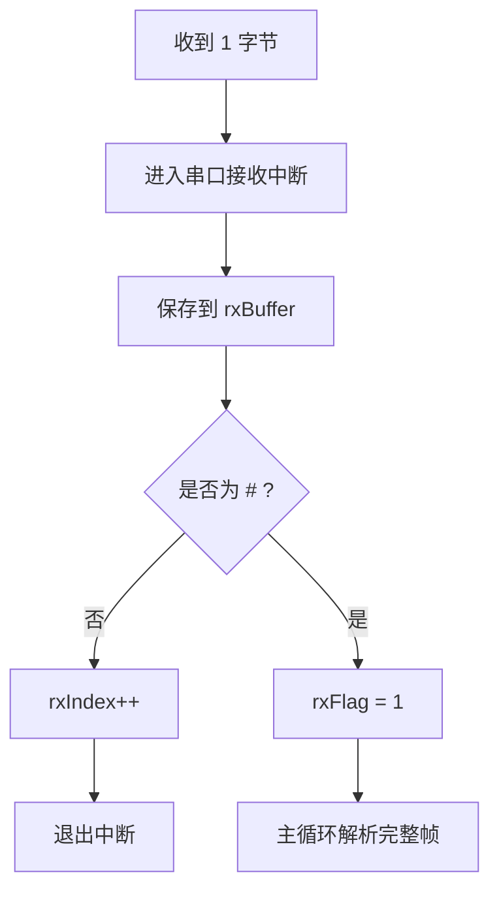

# 串口中断接收

## 1. 本节要解决什么问题

初学者写串口程序时，常见做法是在主循环里一直等串口数据。简单实验可以这样做，但项目里不推荐。因为主循环死等串口时，系统就没法及时处理按键、采样、控制、LED 状态、RS485 方向切换和其他任务。

本节要解决的问题是：

- 为什么不用主循环死等串口；
- 串口接收中断的基本流程；
- `rxBuffer`、`rxIndex`、`rxFlag` 分别做什么；
- 为什么中断里不要做复杂协议解析；
- 如何用帧尾 `#` 判断一帧自定义协议结束；
- 主循环如何处理完整帧；
- 后续如何升级成 Modbus RTU 的接收方式。

## 2. 基本概念

串口接收中断的思想很简单：来了一个字节，硬件触发中断，程序马上把这个字节保存到缓冲区，然后尽快退出中断。

三个常见变量可以这样理解：

| 变量 | 作用 | 类比 |
| --- | --- | --- |
| `rxBuffer` | 存放接收到的字节 | 临时收件箱 |
| `rxIndex` | 记录下一个字节放到哪里 | 收件箱当前格子编号 |
| `rxFlag` | 标记是否收到完整帧 | 老师说“可以开始批改了” |

自定义协议里，可以约定帧尾为 `#`。比如上位机发送：

```text
SET,1200#
```

单片机收到 `#` 后认为一帧结束，把 `rxFlag` 置 1。主循环发现 `rxFlag == 1`，再去解析 `SET,1200`。

## 3. 为什么嵌入式项目需要它

在 RS485、Modbus、Qt 上位机联调项目中，串口数据可能随时到来。如果你在主循环死等串口：

- 控制任务可能被卡住；
- 传感器采样周期可能被打乱；
- RS485 发送后切回接收的时机可能变差；
- FreeRTOS 任务设计会变得混乱；
- 上位机连续发送时容易丢包。

中断接收的价值是：先把数据可靠接住，解析工作放到主循环或通信任务慢慢做。这个思路也很适合面试表达，因为它体现了实时性和模块化意识。

## 4. 工程使用场景

| 场景 | 接收方式 | 一帧结束判断 | 适合阶段 |
| --- | --- | --- | --- |
| 串口打印调试 | 轮询或中断 | 换行符 | 入门 |
| 自定义文本协议 | 接收中断 | 帧尾 `#` | 初学项目 |
| RS485 自定义二进制协议 | 中断 + 长度/校验 | 帧头、长度、校验 | 进阶项目 |
| Modbus RTU | 中断/DMA + 超时 | 帧间静默时间 | 工业协议 |
| FreeRTOS 通信任务 | 中断投递数据，任务解析 | 队列/缓冲区 | 综合项目 |

涉及真实 RS485 设备时，波特率、校验位、停止位、A/B 接线、端子定义、RS485_EN 引脚都必须按芯片手册、模块手册、原理图和实测结果确认。

## 5. 代码示例

下面是一个教学用的自定义协议接收例子：用 `#` 表示一帧结束。中断只负责收字节和置标志，主循环负责解析。

```c
#define RX_BUFFER_SIZE 64

static volatile unsigned char rxFlag = 0;
static volatile unsigned char rxIndex = 0;
static char rxBuffer[RX_BUFFER_SIZE];

void uart_rx_isr(void)
{
    char ch = (char)uart_read_data_register();

    if (rxFlag != 0) {
        return;
    }

    if (rxIndex < RX_BUFFER_SIZE - 1) {
        if (ch == '#') {
            rxBuffer[rxIndex] = '\0';
            rxFlag = 1;
        } else {
            rxBuffer[rxIndex] = ch;
            rxIndex++;
        }
    } else {
        rxIndex = 0;
        rxFlag = 0;
    }
}

void main_loop_process_uart(void)
{
    if (rxFlag == 0) {
        return;
    }

    parse_command(rxBuffer);

    rxIndex = 0;
    rxFlag = 0;
}
```

这个例子适合理解中断接收流程，但不要直接把它当作 Modbus RTU 接收。Modbus RTU 是二进制协议，数据区可能出现任意字节，不能用 `#` 这种字符当帧尾。

后续升级到 Modbus RTU 时，通常改成：

- 中断或 DMA 收字节；
- 用缓冲区保存原始二进制数据；
- 用定时器、空闲中断或帧间静默时间判断一帧结束；
- 主循环或任务中检查地址码、功能码、长度和 CRC。

## 6. 常见错误

| 错误 | 后果 | 正确做法 |
| --- | --- | --- |
| 主循环死等串口 | 其他逻辑卡住 | 用中断接收，主循环处理完整帧 |
| 中断里做复杂解析 | 中断时间太长，后续字节丢失 | 中断只保存字节和置标志 |
| 不检查缓冲区长度 | 数组越界、程序异常 | 每次写入前检查 `rxIndex` |
| `rxFlag` 没加 `volatile` | 主循环可能读不到变化 | 中断共享变量加 `volatile` |
| 收到完整帧后继续写缓冲区 | 原始数据被覆盖 | `rxFlag` 未清前暂停写入或使用双缓冲 |
| 把 `#` 帧尾用于 Modbus RTU | 二进制协议解析错误 | Modbus 用时间间隔和 CRC 判断 |

## 7. 调试方法

调试串口中断接收时，要让问题可观察：



建议步骤：

1. 先用串口助手发送 `LED,1#`，观察 `rxBuffer` 是否为 `LED,1`。
2. 在主循环打印收到的完整帧，不要在中断里大量打印。
3. 故意发送超过缓冲区长度的字符串，观察是否能安全丢弃。
4. 连续发送两帧，观察 `rxFlag` 清除时机是否正确。
5. 改成 RS485 后，再检查方向控制是否影响接收。
6. 升级 Modbus RTU 前，先确认原始十六进制字节能完整保存。

## 8. 面试常问问题

1. 问：为什么不建议主循环死等串口？
   答：死等会阻塞其他任务，比如采样、控制、按键和通信超时处理。工程里通常用中断或 DMA 先接收数据，再在主循环或任务中解析。

2. 问：串口接收中断里一般做什么？
   答：读取数据寄存器、保存字节、更新索引或标志位，然后尽快退出。不要在中断里做复杂协议解析、长时间打印或等待。

3. 问：`rxBuffer`、`rxIndex`、`rxFlag` 分别有什么作用？
   答：`rxBuffer` 保存收到的字节，`rxIndex` 指向下一个写入位置，`rxFlag` 表示已经收到完整帧，主循环可以开始解析。

4. 问：如何用 `#` 判断一帧结束？
   答：自定义文本协议可以约定 `#` 为帧尾。中断中收到 `#` 后给缓冲区补字符串结束符，并置 `rxFlag = 1`，主循环再解析。

5. 问：为什么 Modbus RTU 不能简单用 `#` 做帧尾？
   答：Modbus RTU 是二进制协议，数据区可能出现任意字节，没有固定字符帧尾。它通常依靠帧间静默时间、长度判断和 CRC 校验确认完整帧。

## 9. 简历表达方式

> 基于串口接收中断实现自定义协议帧接收，使用 `rxBuffer/rxIndex/rxFlag` 完成帧尾识别、主循环解析和缓冲区越界保护，并为后续 Modbus RTU 二进制帧接收升级预留接口。

如果项目中确实做了 RS485 或 Qt 上位机联调，可以在后面补一句“配合 Qt 上位机发送测试帧并记录异常输入日志”。

## 10. 小练习

1. 写一个接收 `CMD,123#` 的中断程序，并在主循环打印完整命令。
2. 把缓冲区长度改成 8，测试超长输入时程序是否越界。
3. 连续发送 `A#B#`，观察你的程序能否处理两帧。
4. 思考如果帧尾丢失，程序应该如何超时复位 `rxIndex`。
5. 把文本协议升级成二进制协议，设计帧头、长度和校验字段。

## 11. 小结

串口中断接收的核心原则是：中断快进快出，主循环或任务处理完整帧。`rxBuffer`、`rxIndex`、`rxFlag` 是初学阶段非常好用的一组变量，可以帮助你理解“字节流如何变成一帧命令”。

但也要知道边界：`#` 帧尾适合自定义文本协议，不适合 Modbus RTU。真正进入 RS485/Modbus 项目后，要升级到二进制缓冲区、超时组帧、CRC 校验和日志统计。
