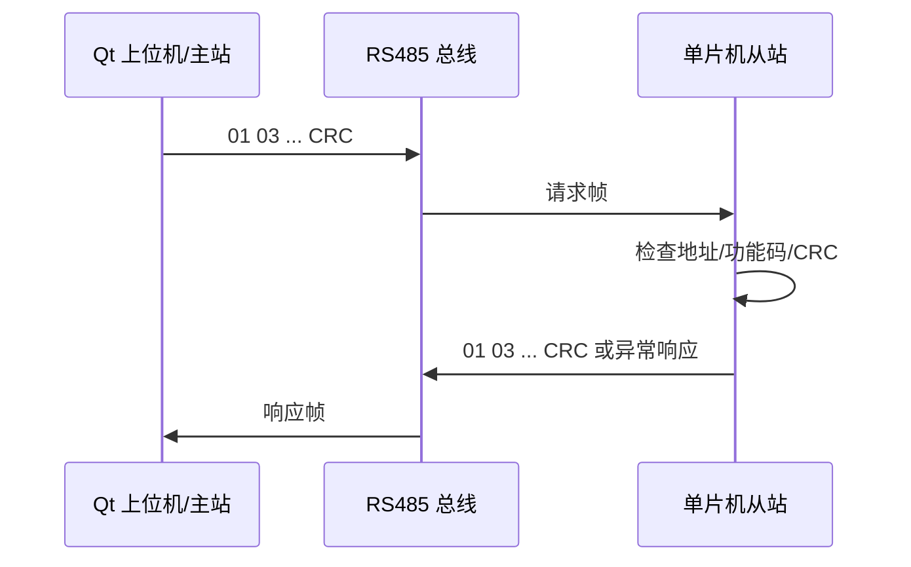

# Modbus RTU 帧格式

## 1. 本节要解决什么问题

很多同学简历写“熟悉 Modbus RTU”，但面试官让他手写一帧 `03` 功能码请求时，就说不清地址码、功能码、数据区和 CRC 的位置。

本节要解决的问题是：

- Modbus RTU 一帧由哪些字段组成；
- 地址码、功能码、数据区、CRC 分别有什么作用；
- `03` 功能码如何读保持寄存器；
- `06` 功能码如何写单个寄存器；
- 异常响应如何判断；
- Modbus RTU 和自定义协议有什么区别；
- 为什么 Modbus RTU 常跑在 RS485 上。

## 2. 基本概念

Modbus RTU 是一种主从式二进制通信协议。主站发请求，从站按地址响应。没有被点名的从站不应该响应。

一帧 Modbus RTU 的基本结构如下：

| 字段 | 长度 | 作用 | 面试要点 |
| --- | --- | --- | --- |
| 地址码 | 1 字节 | 指定从站地址 | 主站用它区分总线上的设备 |
| 功能码 | 1 字节 | 指定读、写等操作 | `0x03` 读保持寄存器，`0x06` 写单寄存器 |
| 数据区 | 不固定 | 地址、数量、字节数、寄存器值等 | 不同功能码格式不同 |
| CRC | 2 字节 | 校验整帧数据 | 低字节在前，高字节在后 |

常见功能码：

| 功能码 | 名称 | 常见用途 |
| --- | --- | --- |
| `0x03` | Read Holding Registers | 读保持寄存器，常用于读参数或状态 |
| `0x04` | Read Input Registers | 读输入寄存器，常用于只读测量值 |
| `0x06` | Write Single Register | 写单个保持寄存器 |
| `0x10` | Write Multiple Registers | 写多个保持寄存器 |

这里的寄存器地址都应来自设备协议手册或项目公开接口文档。本文只使用教学示例地址，不代表任何具体设备。

## 3. 为什么嵌入式项目需要它

Modbus RTU 的好处是把设备能力抽象成寄存器读写。对于嵌入式求职项目，你可以用它搭建一个很清晰的工程闭环：

- 单片机端维护一张教学用寄存器表；
- Qt 上位机发送 `03` 请求读取状态；
- Qt 上位机发送 `06` 请求修改参数；
- 下位机校验地址码、功能码、CRC；
- 双方记录原始十六进制报文和异常响应。

这比“我会串口通信”更有含金量，因为它已经涉及协议设计、二进制解析、错误处理和联调记录。

## 4. 工程使用场景



Modbus RTU 常跑在 RS485 上，是因为：

- RS485 支持差分传输，抗干扰能力比普通 TTL 串口更适合工业现场；
- RS485 适合多点总线，主站可以轮询多个从站；
- Modbus RTU 是主从式协议，和 RS485 的半双工总线模式很匹配；
- 二进制帧比文本协议更紧凑，适合低速串行链路。

涉及真实传感器、驱动器、控制卡或 IO 模块时，寄存器地址、缩放系数、读写权限、异常码含义必须查对应协议手册、模块手册、原理图和实测结果，不能凭经验编造。

## 5. 代码示例

下面的代码构造教学用 `03` 和 `06` 请求帧。示例地址仅用于说明帧格式，不代表任何具体设备。

```c
unsigned short modbus_crc16(const unsigned char *data, unsigned short length);

static void put_u16_be(unsigned char *buf, unsigned short value)
{
    buf[0] = (unsigned char)((value >> 8) & 0xFF);
    buf[1] = (unsigned char)(value & 0xFF);
}

unsigned short modbus_build_03(unsigned char *frame,
                               unsigned char slave,
                               unsigned short start_addr,
                               unsigned short count)
{
    unsigned short crc;

    frame[0] = slave;
    frame[1] = 0x03;
    put_u16_be(&frame[2], start_addr);
    put_u16_be(&frame[4], count);

    crc = modbus_crc16(frame, 6);
    frame[6] = (unsigned char)(crc & 0xFF);
    frame[7] = (unsigned char)(crc >> 8);
    return 8;
}

unsigned short modbus_build_06(unsigned char *frame,
                               unsigned char slave,
                               unsigned short reg_addr,
                               unsigned short value)
{
    unsigned short crc;

    frame[0] = slave;
    frame[1] = 0x06;
    put_u16_be(&frame[2], reg_addr);
    put_u16_be(&frame[4], value);

    crc = modbus_crc16(frame, 6);
    frame[6] = (unsigned char)(crc & 0xFF);
    frame[7] = (unsigned char)(crc >> 8);
    return 8;
}
```

`03` 请求的数据区是“起始地址 + 寄存器数量”；`06` 请求的数据区是“寄存器地址 + 要写入的值”。两者都是大端字段，也就是高字节在前。CRC 则是低字节在前。

异常响应判断示例：

```c
int modbus_is_exception(const unsigned char *frame, unsigned short length)
{
    if (length < 5) {
        return 0;
    }

    if ((frame[1] & 0x80) != 0) {
        return 1;
    }

    return 0;
}
```

如果请求功能码是 `0x03`，异常响应功能码可能是 `0x83`。数据区通常包含异常码，例如非法功能、非法地址、非法数据等。

## 6. 常见错误

| 错误 | 典型现象 | 正确做法 |
| --- | --- | --- |
| 不检查地址码 | 误处理别的从站响应 | 先判断地址是否匹配 |
| CRC 高低字节写反 | 从站不响应或返回异常 | Modbus RTU CRC 低字节在前 |
| 把自定义协议当 Modbus | 功能码和数据区乱套 | 按 Modbus 标准字段解析 |
| 直接编造寄存器含义 | 项目不可验证 | 真实设备必须查协议手册 |
| 不处理异常响应 | 只会说“通信失败” | 判断功能码最高位和异常码 |
| 不区分 `03` 和 `06` | 读写流程混乱 | 读请求和写请求的数据区不同 |

Modbus RTU 和自定义协议的区别：

| 对比项 | 自定义协议 | Modbus RTU |
| --- | --- | --- |
| 字段定义 | 自己设计 | 标准化字段 |
| 帧结束 | 可用帧尾、长度等 | 依靠帧间静默时间和 CRC |
| 兼容性 | 只适合自家程序 | 很多设备和工具支持 |
| 面试表达 | 能体现协议设计能力 | 能体现工业协议理解 |

## 7. 调试方法

调试 Modbus RTU，要逐字节拆帧：

1. 看地址码：是不是目标从站。
2. 看功能码：请求和响应是否对应。
3. 看数据区：起始地址、数量、字节数是否符合功能码格式。
4. 看 CRC：是否低字节在前，计算范围是否正确。
5. 看异常响应：功能码是否加了 `0x80`。
6. 看时间：是否超时、是否多帧粘连。

建议 Qt 上位机或串口助手日志至少包含：

| 日志字段 | 示例内容 | 用途 |
| --- | --- | --- |
| 时间戳 | 12:00:01.123 | 判断超时 |
| 方向 | TX/RX | 区分发送和接收 |
| 原始帧 | 十六进制字节 | 方便逐字节分析 |
| 解析结果 | 功能码、寄存器数量 | 验证协议逻辑 |
| 错误原因 | CRC 错、超时、异常码 | 面试和复盘材料 |

## 8. 面试常问问题

1. 问：Modbus RTU 一帧有哪些字段？
   答：一般包括地址码、功能码、数据区和 CRC。地址码指定从站，功能码指定操作，数据区随功能码变化，CRC 用于校验整帧。

2. 问：`03` 功能码是做什么的？
   答：`03` 用于读保持寄存器。请求数据区包含起始寄存器地址和寄存器数量，响应数据区包含字节数和寄存器数据。

3. 问：`06` 功能码是做什么的？
   答：`06` 用于写单个保持寄存器。请求里包含寄存器地址和写入值，正常响应通常回显同样的地址和值。

4. 问：异常响应怎么判断？
   答：异常响应的功能码会在原功能码基础上加 `0x80`，比如 `0x03` 的异常响应是 `0x83`，后面跟异常码。

5. 问：Modbus RTU 和自定义协议有什么区别？
   答：自定义协议字段由开发者自己定义，灵活但兼容性差；Modbus RTU 是标准协议，有明确地址码、功能码、数据区和 CRC，很多工业设备和调试工具支持。

## 9. 简历表达方式

> 实现 Modbus RTU 帧构造与解析，支持 `03` 读保持寄存器、`06` 写单个寄存器、CRC16 校验和异常响应判断，并通过 Qt 上位机记录原始报文完成协议联调。

不要在简历里写无法公开的设备寄存器表，也不要把教学示例地址写成真实项目参数。

## 10. 小练习

1. 手写一帧教学用 `03` 请求，并标出地址码、功能码、数据区和 CRC。
2. 手写一帧教学用 `06` 请求，说明写入值在数据区中的位置。
3. 给出一帧 `01 83 02 xx xx`，解释它为什么是异常响应。
4. 比较一个 `CMD,ON#` 自定义协议和一帧 Modbus RTU 的区别。
5. 设计 Qt 上位机日志表头，用来记录 TX/RX、原始帧、解析结果和错误原因。

## 11. 小结

Modbus RTU 的核心不是背功能码，而是能把一帧数据逐字节讲清楚。地址码解决“谁响应”，功能码解决“做什么”，数据区解决“操作什么数据”，CRC 解决“帧是否可信”。

嵌入式求职中，如果你能把 Modbus RTU 和 RS485、串口中断、方向控制、Qt 上位机日志联系起来讲，就已经从“会发串口”迈向“会做通信模块”了。
