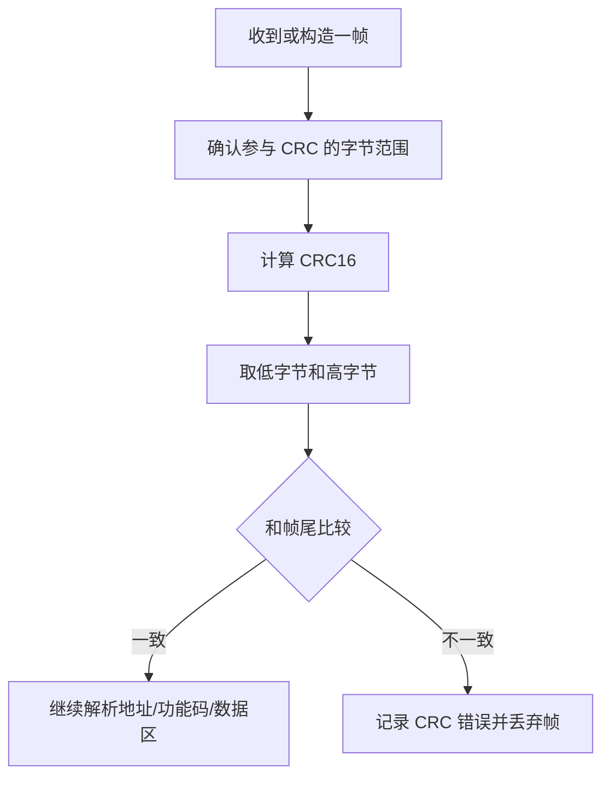

# CRC16 校验

## 1. 本节要解决什么问题

Modbus RTU 报文最后两个字节是 CRC16。初学者调 RS485/Modbus 时，经常遇到“设备不响应”“上位机显示 CRC 错”“明明字节看起来差不多但解析失败”。

本节要解决的问题是：

- CRC 的作用是什么；
- Modbus CRC16 的基本思想是什么；
- 如何用 C 语言计算 CRC；
- 请求帧如何追加 CRC；
- 接收帧如何校验 CRC；
- 常见错误：高低字节顺序、漏算字节、把 ASCII 和十六进制搞混。

## 2. 基本概念

CRC 是循环冗余校验。它不是加密，也不能修复数据，只能帮助判断数据在传输或解析过程中有没有出错。

Modbus RTU 使用 CRC16，常见规则如下：

| 项目 | Modbus CRC16 常见取值 | 说明 |
| --- | --- | --- |
| 初值 | `0xFFFF` | 计算开始时的 CRC 值 |
| 多项式 | `0xA001` | 常见反向算法写法 |
| 计算范围 | 地址码到数据区最后一个字节 | 不包含最后两个 CRC 字节 |
| 放置顺序 | 低字节在前，高字节在后 | 初学者最容易写反 |
| 作用 | 发现帧错误 | 不能替代超时和长度检查 |

可以把 CRC 理解成一张“随帧附带的小验算单”。发送方按前面所有字节算出 CRC 放到帧尾，接收方收到后重新计算并比较。

## 3. 为什么嵌入式项目需要它

RS485 常用于工业现场，可能遇到干扰、线缆接触不良、波特率不匹配、方向切换不合适、终端电阻不合适等问题。CRC 可以帮助软件判断收到的数据是否可信。

在求职项目中，CRC16 是一个很好的能力点，因为它连接了：

- C 语言位运算；
- 二进制协议解析；
- RS485 通信调试；
- Qt 上位机原始报文显示；
- 错误统计和日志分析。

如果你能讲清楚 CRC 怎么算、怎么算错、怎么排查，面试官会觉得你不是只会调用库函数。

## 4. 工程使用场景

| 场景 | CRC 做什么 | 调试价值 |
| --- | --- | --- |
| 主站发送请求 | 对地址码、功能码、数据区计算 CRC 并追加 | 从站才能判断请求是否可靠 |
| 从站接收请求 | 重新计算 CRC 并比较帧尾 | 防止误执行错误命令 |
| 从站返回响应 | 对响应内容追加 CRC | 主站可判断响应是否可信 |
| Qt 上位机显示日志 | 标记 CRC 正确/错误 | 快速定位帧损坏或解析问题 |
| 通信质量统计 | 统计 CRC 错误次数 | 判断干扰、接线或时序问题 |

涉及真实接线时，如果 CRC 错误频繁出现，不能只改软件。还要检查 A/B 线、屏蔽、终端电阻、共地、波特率、RS485_EN 时序等，并以芯片手册、模块手册、原理图和实测结果为准。

## 5. 代码示例

下面是常见 Modbus CRC16 的 C 语言实现：

```c
unsigned short modbus_crc16(const unsigned char *data, unsigned short length)
{
    unsigned short crc = 0xFFFF;
    unsigned short i;
    unsigned char bit;

    for (i = 0; i < length; i++) {
        crc ^= data[i];

        for (bit = 0; bit < 8; bit++) {
            if ((crc & 0x0001) != 0) {
                crc = (crc >> 1) ^ 0xA001;
            } else {
                crc = crc >> 1;
            }
        }
    }

    return crc;
}
```

请求帧追加 CRC：

```c
unsigned short modbus_append_crc(unsigned char *frame,
                                 unsigned short length_without_crc)
{
    unsigned short crc = modbus_crc16(frame, length_without_crc);

    frame[length_without_crc] = (unsigned char)(crc & 0xFF);
    frame[length_without_crc + 1] = (unsigned char)((crc >> 8) & 0xFF);

    return (unsigned short)(length_without_crc + 2);
}
```

接收帧校验 CRC：

```c
int modbus_check_crc(const unsigned char *frame, unsigned short length)
{
    unsigned short crc;
    unsigned char crc_low;
    unsigned char crc_high;

    if (length < 4) {
        return 0;
    }

    crc = modbus_crc16(frame, (unsigned short)(length - 2));
    crc_low = (unsigned char)(crc & 0xFF);
    crc_high = (unsigned char)((crc >> 8) & 0xFF);

    if (frame[length - 2] != crc_low) {
        return 0;
    }

    if (frame[length - 1] != crc_high) {
        return 0;
    }

    return 1;
}
```

教学用请求帧 `01 03 00 00 00 0A` 的 CRC 常见结果是 `C5 CD`，所以完整帧为：

```text
01 03 00 00 00 0A C5 CD
```

注意，这里的 `01` 是一个字节 `0x01`，不是 ASCII 字符 `'0'` 和 `'1'` 两个字节。

## 6. 常见错误

| 错误 | 错在哪里 | 调试办法 |
| --- | --- | --- |
| CRC 高低字节顺序写反 | Modbus RTU 要低字节在前 | 打印最后两个字节核对 |
| 把 CRC 字节也参与计算 | 计算范围多了两个字节 | 只计算地址码到数据区 |
| 漏算地址码 | 计算范围少了第一个字节 | 从 frame[0] 开始计算 |
| 把 ASCII 当十六进制 | 算的是字符 `0` `1`，不是字节 `0x01` | 明确输入是字节数组还是字符串 |
| 帧还没收完整就校验 | 长度不足导致误判 | 先判断长度或帧间超时 |
| 参数用错 | 初值、多项式不匹配 | 用已知测试向量验证函数 |

ASCII 和十六进制的区别尤其重要：

| 表达 | 实际字节 | 含义 |
| --- | --- | --- |
| `"01"` 字符串 | `0x30 0x31` | 两个 ASCII 字符 |
| `0x01` 字节 | `0x01` | 一个二进制字节 |
| `"01 03"` 文本 | 多个字符 | 需要先转换成字节 |
| `{0x01, 0x03}` 数组 | 两个字节 | 可直接参与 CRC |

## 7. 调试方法

调试 CRC 时，不要只说“CRC 不对”，要把过程拆开：



建议步骤：

1. 用固定测试向量验证 CRC 函数，例如 `01 03 00 00 00 0A`。
2. 打印参与 CRC 的每个字节，确认没有漏算或多算。
3. 打印计算出的低字节和高字节。
4. 对照串口助手或 Qt 上位机日志中的帧尾。
5. 如果偶发 CRC 错，检查 RS485 方向切换、波特率、线缆、终端电阻和干扰。
6. 如果每次都 CRC 错，优先检查算法参数、字节顺序和 ASCII/十六进制转换。

## 8. 面试常问问题

1. 问：CRC 的作用是什么？
   答：CRC 用于发现数据传输或解析中的错误。发送方根据数据计算 CRC 放到帧尾，接收方重新计算并比较，一致才认为帧可信。

2. 问：Modbus CRC16 的计算范围是什么？
   答：从地址码开始，到数据区最后一个字节结束，不包含最后两个 CRC 字节。

3. 问：Modbus RTU 中 CRC 高低字节怎么放？
   答：低字节在前，高字节在后。例如计算结果是 `0xCDC5`，帧尾通常放 `C5 CD`。

4. 问：ASCII 字符串 `"01"` 和十六进制字节 `0x01` 有什么区别？
   答：`"01"` 是两个 ASCII 字符，字节值是 `0x30 0x31`；`0x01` 是一个二进制字节。做 Modbus CRC 时必须对真实字节计算。

5. 问：CRC 错误频繁时你怎么排查？
   答：先用固定向量验证算法，再检查计算范围和字节顺序；如果软件没问题，再查波特率、RS485 方向控制、接线、终端电阻、干扰和帧是否收完整。

## 9. 简历表达方式

> 实现 Modbus CRC16 校验模块，支持请求帧 CRC 自动追加、接收帧 CRC 校验、错误帧丢弃和 CRC 错误日志统计，辅助定位 RS485 通信中的帧损坏和字节顺序问题。

这条表达可以和“Modbus RTU 帧解析”“Qt 上位机日志显示”放在同一个项目里，形成完整通信调试闭环。

## 10. 小练习

1. 用 C 语言计算 `01 03 00 00 00 0A` 的 CRC，并写出完整帧。
2. 把完整帧最后两个 CRC 字节调换顺序，观察校验函数是否返回失败。
3. 写一个函数，把字符串 `"01 03 00 00"` 转成字节数组，再参与 CRC。
4. 故意漏掉地址码参与计算，比较 CRC 结果变化。
5. 在 Qt 上位机日志里设计一列 `CRC_OK`，显示每帧校验结果。

## 11. 小结

CRC16 看起来只是两个字节，但它把 C 语言位运算、二进制协议、RS485 现场调试和上位机日志全部连在一起。

记住三个关键点：计算范围不包含 CRC 自己，Modbus RTU 帧尾低字节在前，ASCII 文本和十六进制字节不能混淆。能把这三点讲清楚，你的 Modbus 项目表达就会扎实很多。
