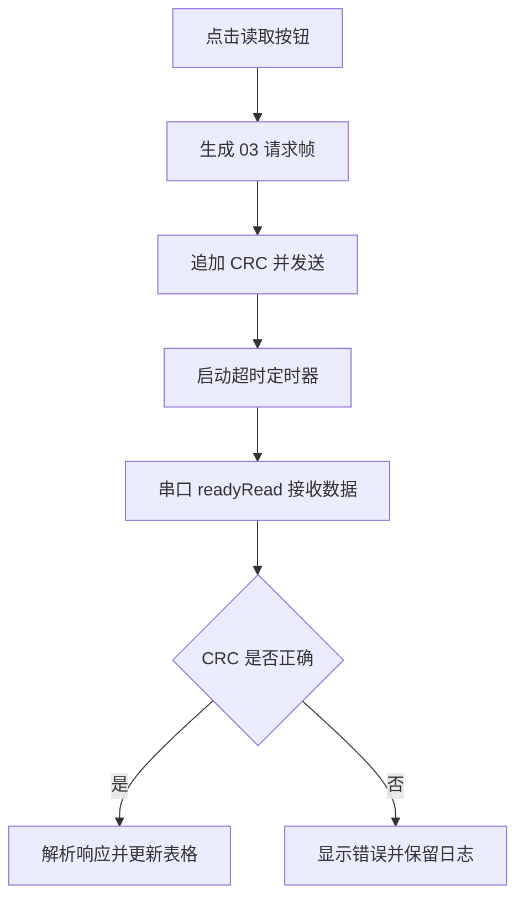

# Modbus 调试上位机项目

## 1. 本节要解决什么问题

这一节要解决的问题是：如何把 Qt、串口、Modbus RTU、日志和寄存器表组合成一个能演示、能调试、能写进简历的上位机项目。

很多同学学 Qt 时只会拖按钮，学 Modbus 时只会看帧格式，两个知识点是分开的。真正面试时，面试官更关心的是：你能不能用上位机把下位机设备调通？能不能看到发送帧、接收帧、CRC、超时、异常响应？能不能根据日志定位问题？

所以这个项目不是追求界面花哨，而是训练一个工程能力：用 Qt 做一个串口调试工具，围绕 Modbus RTU 的 03 读保持寄存器、06 写单个寄存器完成请求、响应、解析、显示和日志保存。

## 2. 基本概念

Qt 上位机是运行在 PC 端的软件，常用来调试单片机、控制器、传感器模块或工业设备。它通过串口、USB 转串口、RS485 转换器等链路和下位机通信。

Modbus 调试上位机的核心模块可以这样理解：

| 模块 | 作用 | 面试时怎么说 |
|---|---|---|
| 串口配置 | 设置端口号、波特率、校验位、停止位 | 我能根据设备参数建立通信链路 |
| 帧生成 | 按 Modbus RTU 格式生成请求帧 | 我理解地址码、功能码、数据区和 CRC |
| 发送接收 | 通过 QSerialPort 发送并接收字节流 | 我知道串口通信是异步过程 |
| CRC 校验 | 校验响应帧是否可靠 | 我能区分链路问题和协议问题 |
| 日志显示 | 保存 TX/RX 原始十六进制数据 | 我能复盘通信问题 |
| 寄存器表 | 显示读回的数据或写入结果 | 我能把协议数据转成可读信息 |

注意，Qt 上位机不等于下位机控制程序。上位机负责配置、调试、显示和记录；真正的采集、控制和实时动作通常在单片机或嵌入式 Linux 设备中完成。

## 3. 工程用途

在抽象工业控制或机器视觉控制系统中，上位机经常用于参数配置、设备状态查看、动作测试、日志记录和故障复现。比如你可以用它读取某个模拟寄存器中的状态值，也可以向某个模拟寄存器写入控制参数。

公开学习项目中不要编造具体设备型号、客户产线或真实寄存器地址。如果涉及真实控制卡、驱动器、传感器、端子定义或 RS485 接线，必须以对应芯片手册、模块手册、设备手册、原理图和实测结果为准，不能凭经验写“A 接 A、B 接 B”之类的绝对结论。

这个项目适合放进简历，因为它能把多条能力线连起来：

- 下位机通信：理解 RS485 和 Modbus RTU。
- PC 软件：会用 Qt 编写基础上位机。
- 工程调试：保留原始帧、超时、异常响应和日志。
- 面试表达：能讲清楚从点击按钮到设备响应的完整链路。

## 4. 简单代码或伪代码

下面代码只演示教学思路，不依赖真实设备寄存器。Qt 项目中可以把它放在按钮槽函数和串口接收槽函数附近。

```cpp
void MainWindow::sendReadHoldingRegisters()
{
    QByteArray frame;

    frame.append(char(0x01));      // 从机地址
    frame.append(char(0x03));      // 功能码：读保持寄存器
    frame.append(char(0x00));      // 起始地址高字节，教学示例
    frame.append(char(0x00));      // 起始地址低字节
    frame.append(char(0x00));      // 寄存器数量高字节
    frame.append(char(0x02));      // 读取 2 个寄存器

    appendModbusCrc(frame);        // 追加 CRC 低字节、高字节
    serial.write(frame);
    timeoutTimer.start(500);

    appendLog("TX", frame);
}

void MainWindow::onSerialReadyRead()
{
    rxBuffer.append(serial.readAll());
    appendLog("RX", rxBuffer);

    if (!isFrameLengthEnough(rxBuffer)) {
        return;
    }

    if (!checkModbusCrc(rxBuffer)) {
        showStatus("CRC error");
        return;
    }

    parseModbusResponse(rxBuffer);
    rxBuffer.clear();
    timeoutTimer.stop();
}
```

一个最小的流程可以这样画：



初学时先不要急着做复杂界面。先把“发送一帧、收到一帧、校验一帧、显示一帧”跑通，再逐步加入表格、保存日志、异常响应提示。

## 5. 常见错误

1. 只显示解析后的数值，不保存原始十六进制帧。这样一旦通信异常，你就不知道到底是下位机没回、CRC 错了，还是解析代码写错了。
2. 把十六进制帧当成 ASCII 字符串处理。例如 `"01 03 00 00"` 和真实字节 `0x01 0x03 0x00 0x00` 不是一回事。
3. 点击按钮后直接等待接收，阻塞 UI 线程，导致窗口卡死。Qt 串口接收应尽量使用信号槽和缓冲区。
4. 没有做超时处理。实际项目中从机掉线、地址错误、波特率错误时都可能没有响应。
5. 没有区分正常响应和异常响应。Modbus 异常响应的功能码会在原功能码基础上加 `0x80`。
6. 简历上写“开发工业上位机”，但代码只有按钮和打印，没有协议解析、日志和调试证据。

## 6. 调试方法

调试 Qt Modbus 上位机时，可以按从软件到硬件的顺序来做。

第一步，用固定测试帧验证 CRC 函数。比如先在程序里生成 03 请求帧，确认追加后的 CRC 字节顺序是 Modbus RTU 要求的低字节在前、高字节在后。

第二步，用虚拟串口或串口助手联调。上位机发送一帧后，先确认串口助手看到的 TX 原始字节正确，再模拟返回一帧响应。

第三步，接入真实 RS485 链路。接线、端子定义、A/B 标识、终端电阻、隔离电源和地参考都必须查设备手册、模块手册、原理图，并用万用表或示波器等手段实测确认，不能靠经验猜。

第四步，保存日志。建议日志至少包含时间、方向、原始帧、解析结果、错误类型。面试时你能拿出这种日志，说明你不是只会“跑通一次”，而是懂得工程调试。

| 现象 | 可能原因 | 验证方法 |
|---|---|---|
| 没有任何响应 | 串口参数错误、地址错误、接线错误、从机未运行 | 先用串口助手和示波器确认 TX 是否发出 |
| 有响应但 CRC 错 | 帧截断、字节顺序错误、把 ASCII 当字节 | 保存原始帧并单独计算 CRC |
| UI 卡死 | 在主线程中阻塞等待 | 改用 readyRead 和 QTimer |
| 偶发超时 | RS485 方向切换、干扰、帧间隔处理不当 | 对比下位机日志和上位机时间戳 |

## 7. 面试常问问题

1. 问：Qt 上位机在 Modbus 调试中主要做什么？
   答：它负责串口配置、请求帧生成、响应接收、CRC 校验、数据解析、日志显示和异常提示。它不是实时控制核心，而是调试和配置工具。

2. 问：为什么要保存原始 TX/RX 帧？
   答：原始帧是定位问题的证据。只看解析值无法判断问题发生在发送、链路、CRC、帧长度还是解析逻辑。

3. 问：QSerialPort 接收为什么不能简单认为 readyRead 一次就是一帧？
   答：串口是字节流，readyRead 只表示当前有数据可读，不保证刚好是一帧。需要缓冲区、长度判断、CRC 校验或超时机制来判断完整帧。

4. 问：Modbus 异常响应怎么识别？
   答：异常响应中功能码会等于原功能码加 `0x80`，后面跟异常码。比如 03 功能码异常响应的功能码是 `0x83`。

5. 问：你会如何设计这个上位机的日志？
   答：我会记录时间戳、TX/RX 方向、原始十六进制帧、解析结果、错误类型和串口参数，方便复现问题，也方便面试时说明调试过程。

## 8. 简历表达方式

> 完成个人 Modbus RTU 调试上位机项目，基于 Qt/QSerialPort 实现串口参数配置、03/06 功能码请求生成、响应帧 CRC 校验、寄存器数据显示、异常响应提示和 TX/RX 原始日志记录，可配合单片机模拟从机完成 RS485 通信链路调试。

这条表达里没有写真实公司、客户或设备内部资料，也没有夸大成“工业现场交付”。它强调的是你能解释、能展示、能复盘的能力。

## 9. 小练习

1. 设计一个上位机界面草图，至少包含串口配置区、功能码操作区、寄存器表和日志区。
2. 写出 03 读保持寄存器的发送流程，从点击按钮到日志显示，每一步用一句话说明。
3. 给 `readyRead` 接收流程加一个超时处理：500 ms 内没有完整响应就提示超时。
4. 设计 4 条日志样例：正常 03 响应、正常 06 响应、CRC 错误、从机无响应。

## 10. 小结

Modbus 调试上位机项目的重点不是界面多漂亮，而是通信链路是否清楚、原始数据是否保留、错误是否能定位。你要能讲清楚：上位机如何生成请求帧，如何通过串口发出，如何接收字节流，如何判断 CRC，如何解析正常响应和异常响应。做到这些，这个项目就能成为嵌入式求职中很有说服力的一环。
