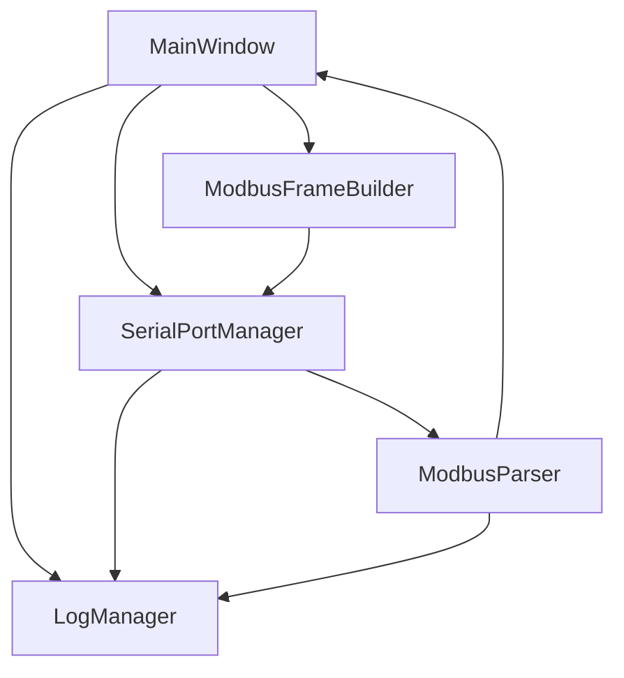

# Qt 上位机模块划分

## 1. 为什么要模块划分

如果所有逻辑都写在 `MainWindow` 里，项目很快会变成按钮槽函数堆叠：打开串口、组帧、解析、日志、表格更新全部混在一起。面试时也很难解释。

模块划分的目标是让每个类只负责一件事。

## 2. 推荐模块

| 模块 | 输入 | 输出 |
|---|---|---|
| `SerialPortManager` | 串口参数、待发送字节 | 发送结果、接收字节信号 |
| `ModbusFrameBuilder` | 地址、功能码、寄存器地址、数据 | 完整请求帧 |
| `ModbusParser` | 接收缓冲区 | CRC 结果、功能码、寄存器数据、异常码 |
| `LogManager` | 时间、方向、原始帧、解析结果 | 屏幕日志、CSV 文件 |
| `MainWindow` | 用户操作 | 调用各模块并更新 UI |

## 3. 调用关系



## 4. 信号槽建议

```cpp
connect(serialManager, &SerialPortManager::bytesReceived,
        this, &MainWindow::onBytesReceived);

connect(this, &MainWindow::sendFrameRequested,
        serialManager, &SerialPortManager::sendFrame);
```

示例只表达结构，不要求初学者一开始就写完整 Qt 工程。C++ 示例代码遵守本仓库约定，不写 `std::` 前缀。

## 5. 面试讲法

可以这样回答：

> 我把 Qt 上位机拆成串口管理、Modbus 组帧、响应解析、日志管理和界面显示几个模块。这样串口层只负责字节收发，协议层只负责帧格式和 CRC，界面层只负责用户交互和结果展示。调试时可以分别定位串口参数、协议帧、CRC 和 UI 显示问题。
