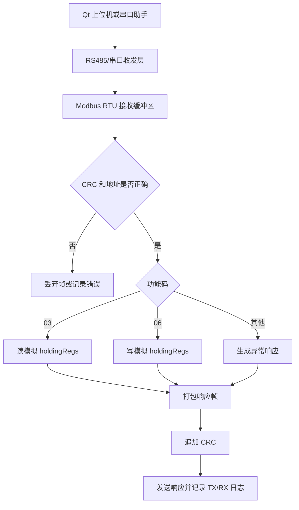

# Modbus RTU 设备调试项目

## 1. 本节要解决什么问题

这一节要解决的问题是：如何把 Modbus RTU 从“我知道帧格式”变成“我能做一个可演示的设备调试项目”。

初学者常见的问题是：CRC 会写，03 功能码也看过，但项目一讲就变成“我实现了通信”。面试官继续问：怎么判断一帧完整？怎么处理异常响应？怎么验证读写寄存器？怎么定位 CRC 错误？这时如果没有项目闭环，就很难讲清楚。

本项目建议做成个人学习项目：用单片机或纯 C 程序模拟 Modbus RTU 从机，用 Qt 上位机或串口助手作为主机，支持 03 读保持寄存器和 06 写单个寄存器。寄存器表使用模拟数组，不绑定任何真实设备，不编造具体寄存器地址。

## 2. 基本概念

Modbus RTU 是一种常见的串行通信协议，常跑在 RS485 物理层上。RS485 解决的是差分电气传输问题，Modbus RTU 解决的是一帧数据中每个字节是什么意思的问题。

这个项目可以拆成几个清楚的模块：

| 模块 | 输入 | 输出 | 训练能力 |
|---|---|---|---|
| 帧接收 | 串口字节流 | 完整请求帧 | 缓冲区、超时、帧完整性 |
| CRC 校验 | 请求帧 | 正确或错误 | 数据可靠性判断 |
| 功能码解析 | 地址码、功能码、数据区 | 操作类型 | 协议理解 |
| 寄存器表 | 模拟数组 | 读写结果 | 数据模型设计 |
| 响应生成 | 处理结果 | 正常响应或异常响应 | 工程闭环 |
| 日志记录 | TX/RX 原始帧 | 调试证据 | 面试复盘 |

03 功能码用于读保持寄存器，典型请求包含从机地址、功能码、起始地址、寄存器数量和 CRC。06 功能码用于写单个保持寄存器，典型请求包含从机地址、功能码、寄存器地址、写入值和 CRC。

异常响应也要做。比如地址越界、寄存器数量不合法、功能码不支持时，从机不能假装没事，而应返回符合 Modbus 思路的异常响应。教学项目中只需要保留核心逻辑，不要编造成真实设备的私有协议。

## 3. 工程用途

这个项目能帮助你建立“协议项目”的完整思维：不是只写一个 CRC 函数，而是从请求帧进入系统，到校验、解析、执行业务、生成响应、保存日志，每一步都有明确边界。

在抽象工业控制场景中，Modbus RTU 常用于参数读取、状态查询、简单控制量写入等任务。在机器视觉控制系统的抽象案例里，也可以把它理解为“上位机或控制器读取某个模块状态、写入某个配置参数”的通信方式。但公开资料库中不能写真实公司、客户、产线、设备内部地址或项目交付效果。

涉及 RS485 接线、端子定义、驱动器、控制卡、传感器或现场模块时，必须以数据手册、端子定义、原理图和实测结果为准。不同模块对 A/B 标识、使能脚、隔离电源和地参考的说明可能不同，不能凭经验编造。

## 4. 简单代码或伪代码

项目主流程可以先写成下面这样：

```text
主机发送 03/06 请求
-> 从机接收字节流并判断完整帧
-> 校验地址码和 CRC
-> 根据功能码进入 03 或 06 处理函数
-> 访问模拟 holdingRegs 数组
-> 生成正常响应或异常响应
-> 主机显示 TX/RX 日志和解析结果
```

下面是一个偏嵌入式 C 风格的核心处理示例，只用于教学，不代表真实设备协议。

```c
#include <stdint.h>
#include <stddef.h>

#define SLAVE_ADDR  0x01
#define REG_COUNT   16
#define MODBUS_OK   0
#define MODBUS_ERR  1

static uint16_t holdingRegs[REG_COUNT] = {
    100, 200, 300, 400
};

static int is_valid_range(uint16_t start, uint16_t count)
{
    if (count == 0) {
        return 0;
    }

    if ((start + count) > REG_COUNT) {
        return 0;
    }

    return 1;
}

int handle_read_03(uint16_t start, uint16_t count)
{
    if (!is_valid_range(start, count)) {
        return MODBUS_ERR;
    }

    for (uint16_t i = 0; i < count; i++) {
        uint16_t value = holdingRegs[start + i];
        (void)value;  // 教学示例：实际项目中应打包到响应帧
    }

    return MODBUS_OK;
}

int handle_write_06(uint16_t addr, uint16_t value)
{
    if (!is_valid_range(addr, 1)) {
        return MODBUS_ERR;
    }

    holdingRegs[addr] = value;
    return MODBUS_OK;
}
```

这段代码的重点不是功能多，而是边界清楚：地址是否合法、数量是否合法、读写的是模拟数组、错误时可以走异常响应。面试时你要能解释为什么先检查范围，再访问数组。

## 5. 常见错误

1. 直接使用网上某个真实设备的寄存器表，却没有说明来源，也无法验证。这不适合公开资料库和个人项目展示。
2. 只处理正常响应，不处理 CRC 错误、地址错误、功能码不支持和寄存器越界。
3. 把 Modbus RTU 当成字符串协议，用 `#` 或换行判断结尾。RTU 是二进制帧，通常要依靠帧间隔、长度和 CRC 判断。
4. 03 功能码和 06 功能码混在一个大函数里，导致面试时讲不清模块边界。
5. 没有测试用例。项目是否可靠，不能只靠“我点了一次能通”。
6. 简历写“熟悉工业协议”，但项目里没有原始帧、CRC、异常响应和调试记录。

## 6. 调试方法

建议按四层调试。

第一层，纯软件验证。先不接硬件，用固定数组、固定请求帧测试 03 和 06 的解析流程，确认功能码、地址、数量和 CRC 都处理正确。

第二层，上位机联调。用 Qt 上位机或串口助手发送请求，确认从机返回的原始响应帧和解析结果一致。

第三层，RS485 链路验证。接入 USB 转 RS485 模块和目标板时，必须查模块手册、芯片手册、端子定义、原理图，并通过实测确认方向控制、A/B 标识和供电方式。

第四层，异常测试。故意发送错误 CRC、错误从机地址、不支持的功能码、越界寄存器地址，确认从机不会死机，并能返回可解释的错误或至少留下日志。

| 测试项 | 输入示例 | 期望结果 |
|---|---|---|
| 03 正常读取 | 地址合法，数量合法 | 返回字节数和寄存器数据 |
| 06 正常写入 | 地址合法，写入值合法 | 回显写单寄存器请求 |
| CRC 错误 | 修改最后一个 CRC 字节 | 丢弃帧或记录 CRC 错误 |
| 地址越界 | 起始地址超过模拟数组 | 返回异常响应或错误日志 |
| 功能码不支持 | 使用未实现功能码 | 返回功能码不支持 |

调试记录要保留 TX/RX 原始十六进制帧。这样面试时你可以用“现象、定位、验证、修复”的方式回答，而不是只说“后来调好了”。

## 7. 面试常问问题

1. 问：Modbus RTU 项目中 03 和 06 功能码分别做什么？
   答：03 用于读保持寄存器，主机给出起始地址和寄存器数量；06 用于写单个保持寄存器，主机给出寄存器地址和写入值。

2. 问：为什么这个项目使用模拟寄存器数组？
   答：学习项目要先把协议流程讲清楚，模拟数组能避免绑定真实设备和真实寄存器表，也符合公开资料库不泄露真实项目细节的要求。

3. 问：Modbus RTU 和自定义 `#` 结尾协议有什么区别？
   答：自定义 `#` 协议通常用特定字符判断帧尾，适合入门；Modbus RTU 是二进制协议，包含地址码、功能码、数据区和 CRC，通常通过长度、帧间隔和 CRC 判断帧完整性。

4. 问：如果读寄存器返回 CRC 错误，你怎么查？
   答：先保存原始响应帧，单独计算 CRC；再检查是否漏算字节、高低字节顺序是否反了、接收是否截断；最后再查波特率、校验位、RS485 方向切换和线路干扰。

5. 问：如何把这个项目讲成简历亮点？
   答：不要只说“实现 Modbus 通信”，要说清楚支持哪些功能码、如何做 CRC 校验、如何处理异常响应、如何用上位机和日志完成联调。

## 8. 简历表达方式

> 完成个人 Modbus RTU 设备调试项目，基于模拟保持寄存器表实现 03 读保持寄存器、06 写单个寄存器、CRC16 校验、异常请求处理和 TX/RX 日志记录，并通过 Qt 上位机或串口助手验证请求解析、响应生成和错误定位流程。

这条表达的好处是边界清楚：它说明是个人项目，说明使用模拟寄存器，没有伪装成真实公司项目，也能体现协议解析和工程调试能力。

## 9. 小练习

1. 画出 03 功能码从请求进入到响应发出的完整流程图，标出 CRC 校验的位置。
2. 给模拟寄存器数组增加 8 个数据，并写出读 2 个寄存器、写 1 个寄存器的测试用例。
3. 设计 4 种异常输入：错误 CRC、非法地址、非法数量、不支持功能码，并说明期望输出。
4. 把本项目改写成 1 分钟面试回答，要求包含需求、实现、调试和改进。

## 项目展示化补充

### 项目结构

```text
modbus_rtu_device_demo/
├── main.c              教学入口和测试帧
├── modbus_crc16.c      CRC16 计算和校验
├── modbus_slave.c      从机请求解析和响应生成
├── holding_regs.c      模拟保持寄存器表
├── uart_port.c         串口收发适配层，教学时可留空
└── test_logs/          03/06 正常与异常测试记录
```

### 运行流程

```text
主机发送 03/06 请求帧
-> 从机接收完整 RTU 帧
-> 校验从机地址和 CRC
-> 分发到 03 或 06 处理函数
-> 读写 holdingRegs 模拟数组
-> 打包正常响应或异常响应
-> 主机保存 TX/RX 日志
```

这个流程只使用模拟寄存器，不提供真实设备寄存器地址。真实设备寄存器表必须来自厂家手册、项目公开文档或自己可验证的资料，不能猜。

### 测试用例

| 测试项 | 输入 | 期望结果 |
|---|---|---|
| 03 正常读取 | 读起始地址 0，数量 2 | 返回 4 字节寄存器数据 |
| 06 正常写入 | 写地址 1，值 1234 | 回显写单寄存器请求 |
| CRC 错误 | 修改最后一个 CRC 字节 | 丢弃或记录 CRC 错误 |
| 地址越界 | 起始地址超过数组范围 | 返回异常响应 |
| 功能码不支持 | 发送未实现功能码 | 返回功能码不支持 |

### 调试日志样例

```text
[11:05:44.010] TX 01 03 00 00 00 02 C4 0B
[11:05:44.018] RX 01 03 04 00 64 00 C8 BA 7A
[11:05:44.019] PARSE addr=1 func=03 regs[0]=100 regs[1]=200 crc=OK
```

面试时可以用这条日志说明 03 响应中的字节数、寄存器高低字节和 CRC 校验过程。

## 旗舰项目扩展

如果你准备把本仓库用于 GitHub/Gitee 展示，建议把本项目作为第一版旗舰项目。原因很简单：Modbus RTU 项目能同时体现串口、RS485、二进制协议、CRC、寄存器模型、异常处理、上位机联调和调试日志，比单独一个 LED 或按键项目更接近嵌入式软件岗位的面试场景。

### 项目目标

本项目的目标不是接入某个真实设备，而是完成一个公开、可复现、可讲清楚的教学闭环：

- 主机能发送 03 读保持寄存器请求；
- 主机能发送 06 写单个寄存器请求；
- 从机能校验地址码、功能码、数据区和 CRC；
- 从机能访问模拟保持寄存器数组；
- 从机能返回正常响应或异常响应；
- 调试过程能保留 TX/RX 原始帧、解析结果和错误原因。

这里的“寄存器地址”只指模拟数组索引，不代表任何真实设备寄存器表。真实项目必须查厂家手册、公开协议文档或实测结果，不能凭经验编造。

### 软件架构图



面试时可以按这张图讲：上位机只是主机，从机协议层负责判断帧是否可靠，寄存器表负责保存模拟数据，响应生成层负责把处理结果变回 Modbus RTU 帧。

### 推荐代码入口

| 代码文件 | 在项目中的角色 | 建议讲法 |
|---|---|---|
| `../03_RS485_Modbus/codes/modbus_crc16.c` | CRC16 计算和校验 | 我能说明 CRC 覆盖哪些字节，以及低字节在前的问题 |
| `../03_RS485_Modbus/codes/modbus_rtu_demo.c` | 03/06 功能码解析和模拟寄存器 | 我用模拟数组代替真实设备寄存器，避免编造设备资料 |
| `../03_RS485_Modbus/codes/rs485_frame_demo.c` | 自定义协议接收入门 | 我先用 `#` 帧尾理解缓冲区，再升级到 Modbus RTU |

这三个文件不是完整商业项目，而是教学项目的核心代码证据。简历和面试中要如实说明是个人学习项目。

### 测试用例清单

| 编号 | 测试目的 | 输入条件 | 期望结果 |
|---|---|---|---|
| T01 | 验证 03 正常读取 | 从模拟索引 0 开始读 2 个寄存器 | 返回 2 个寄存器数据，CRC 正确 |
| T02 | 验证 06 正常写入 | 写模拟索引 1，写入值 1234 | 回显写入地址和值，再读可验证变化 |
| T03 | 验证 CRC 错误处理 | 修改请求帧最后一个 CRC 字节 | 不执行寄存器读写，记录 CRC 错误 |
| T04 | 验证地址越界 | 读取超过模拟数组范围的数据 | 返回异常响应或错误日志 |
| T05 | 验证功能码不支持 | 发送未实现功能码 | 返回功能码不支持 |
| T06 | 验证从机地址过滤 | 发送非本机地址 | 不响应或记录地址不匹配 |
| T07 | 验证上位机超时 | 从机不返回响应 | 上位机提示超时并保留 TX 日志 |

如果你后续写 GitHub Issues 或项目复盘，可以把这些测试用例改写成检查清单。这样别人看仓库时，会更容易相信你真的理解“如何验证一个通信项目”。

### 演示步骤

```text
1. 打开 Qt 上位机或串口助手，配置串口参数。
2. 发送 03 请求，读取模拟保持寄存器。
3. 查看 RX 原始帧，手动解释地址码、功能码、字节数、数据区和 CRC。
4. 发送 06 请求，写入某个模拟寄存器。
5. 再次发送 03 请求，验证写入结果是否生效。
6. 故意发送错误 CRC 或越界地址，观察错误日志或异常响应。
7. 把一次正常通信和一次异常通信整理成面试复盘。
```

这里不要求你一次接入真实硬件。第一阶段用模拟数组和串口助手就可以训练协议能力；第二阶段再接入真实 RS485 链路，并严格按设备手册、原理图和实测结果核验。

### 面试讲法

可以准备一段 1 分钟回答：

> 这个项目是我用于学习和展示 Modbus RTU 通信链路的个人项目。我用模拟保持寄存器数组代替真实设备寄存器，支持 03 读保持寄存器和 06 写单个寄存器。通信流程中会先接收完整 RTU 帧，再校验从机地址和 CRC，然后根据功能码分发到不同处理函数，最后打包正常响应或异常响应。调试时我会保留 TX/RX 原始十六进制日志，通过错误 CRC、越界地址、不支持功能码等测试用例验证异常处理。这个项目重点训练的是协议解析、CRC 校验、寄存器模型和通信问题定位能力。

面试官如果追问“有没有真实设备”，要诚实回答：这是公开学习项目，使用模拟寄存器，不包含真实公司或设备内部资料；真实接入时必须根据设备手册和实测结果确认寄存器表、接线和串口参数。

### 简历写法

推荐写法：

> 个人项目：Modbus RTU 设备调试 Demo。基于 C 语言实现 Modbus RTU 从机解析流程，支持 03 读保持寄存器、06 写单个寄存器、CRC16 校验、模拟寄存器读写和异常请求处理；配合 Qt 上位机或串口助手记录 TX/RX 原始帧，设计正常读写、CRC 错误、地址越界、功能码不支持等测试用例，完成通信问题定位复盘。

不推荐写法：

> 负责某工业设备 Modbus 通信开发，实现现场稳定运行。

后者如果没有真实、可公开、可证明的项目背景，就容易被面试追问击穿，也不符合本仓库的公开资料边界。

## 10. 小结

Modbus RTU 设备调试项目的价值在于把协议知识变成工程闭环。你要能说清楚地址码、功能码、数据区、CRC、03/06 处理、异常响应、日志和联调方法。只要项目边界真实、代码能跑、日志能解释，它就能成为嵌入式求职中非常扎实的项目材料。
