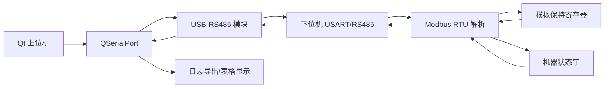

# 下位机通信控制器 + Qt 上位机完整项目

## 1. 本节要解决什么问题

本节要解决的问题是：如何把前面学过的单片机、RS485/Modbus、状态解析、FreeRTOS 思路、Qt 上位机和求职表达整合成一个完整作品集项目。

单独学一个知识点很容易，但面试时通常会问：“你做过什么项目？”这个项目的目标是给出一条完整链路：

```text
Qt 上位机发送 Modbus 请求
-> USB-RS485 链路
-> 下位机通信控制器接收并解析
-> 访问模拟寄存器和状态字
-> 回发响应帧
-> Qt 上位机显示寄存器和导出日志
```

本项目使用模拟寄存器和抽象状态，不绑定真实公司、客户、产线或具体设备。

## 2. 项目目标

第一版只做可展示闭环，不追求复杂功能：

| 功能 | 下位机 | Qt 上位机 |
|---|---|---|
| 串口通信 | USART/RS485 收发 | QSerialPort 收发 |
| 协议支持 | Modbus RTU 03/06 | 生成 03/06 请求帧 |
| 数据模型 | 模拟保持寄存器、状态字 | 表格显示寄存器和状态 |
| 调试能力 | CRC 错误计数、超时计数 | TX/RX 日志、CSV 导出 |
| 面试材料 | 代码结构、测试用例 | 界面结构、日志样例 |

涉及真实硬件时，串口参数、RS485 A/B 端子、供电、地线、终端电阻、驱动器或传感器接口必须以数据手册、原理图、端子定义和实测结果为准。

## 3. 软件架构



建议分层：

| 层级 | 下位机模块 | 上位机模块 |
|---|---|---|
| 驱动层 | USART、RS485_EN、定时器 | QSerialPort |
| 协议层 | Modbus 解析、CRC16 | Modbus 组帧、响应解析 |
| 数据层 | holdingRegs、statusWord | 寄存器表、状态显示 |
| 调试层 | 错误计数、原始帧缓存 | TX/RX 日志、CSV 导出 |

## 4. 下位机设计

下位机建议先用裸机实现，再考虑 FreeRTOS 改造。

最小模块：

```text
mcu_controller/
├── main.c
├── bsp_uart.c
├── bsp_rs485.c
├── modbus_crc16.c
├── modbus_slave.c
├── register_map.c
└── machine_status.c
```

核心流程：

```text
串口接收字节
-> 判断 RTU 帧完整
-> 校验地址和 CRC
-> 分发 03/06 功能码
-> 读写模拟 holdingRegs
-> 更新 statusWord
-> 打包响应并切换 RS485 发送方向
```

注意：RS485 发送完成后必须等待发送完成标志，再切回接收。不同芯片的发送完成标志、DE/RE 控制方式和延时要求必须查芯片手册和实测波形。

## 5. Qt 上位机设计

Qt 上位机建议按 `07_Qt上位机/project_skeleton` 组织。

最小功能：

- 串口参数配置；
- 打开/关闭串口；
- 03 读保持寄存器；
- 06 写单个寄存器；
- 响应 CRC 校验；
- 寄存器表显示；
- 状态字解析显示；
- TX/RX 日志导出。

界面不需要复杂。第一版重点是能复现通信链路和保存证据。

## 6. 联调流程

建议按以下顺序联调：

1. 先不接 RS485，使用本地模拟函数测试 Modbus 03/06 解析。
2. 用串口助手发送固定请求帧，确认下位机能回发响应。
3. 接入 Qt 上位机，确认 TX 日志与串口助手一致。
4. 测试 03 读取模拟寄存器。
5. 测试 06 写入模拟寄存器，再用 03 读回验证。
6. 故意发送错误 CRC、非法地址、不支持功能码，确认异常处理。
7. 保存正常通信和异常通信日志。

## 7. 测试用例

| 编号 | 测试内容 | 期望结果 |
|---|---|---|
| T01 | Qt 发送 03 读 2 个寄存器 | 下位机返回 2 个寄存器值 |
| T02 | Qt 发送 06 写单个寄存器 | 下位机回显写入地址和值 |
| T03 | 写入后再读取 | 读回值等于写入值 |
| T04 | 错误 CRC 请求 | 下位机不执行写入并记录错误 |
| T05 | 非法寄存器地址 | 返回异常响应或错误日志 |
| T06 | 下位机无响应 | Qt 显示超时并保留 TX |
| T07 | 状态字变化 | Qt 状态表同步更新 |

## 8. 调试日志样例

```text
[09:10:01.120] QT TX 01 03 00 00 00 02 C4 0B
[09:10:01.138] MCU RX addr=1 func=03 crc=OK
[09:10:01.139] MCU READ start=0 count=2 values=100,200
[09:10:01.145] QT RX 01 03 04 00 64 00 C8 BA 7A
[09:10:01.146] QT PARSE regs[0]=100 regs[1]=200
```

日志要保留原始帧。只保存“读取成功”没有调试价值。

## 9. 面试讲法

一分钟版本：

> 这个项目是一个个人嵌入式通信闭环项目。下位机用 USART/RS485 接收 Modbus RTU 请求，支持 03 读保持寄存器和 06 写单个寄存器，内部使用模拟寄存器表和状态字，不绑定真实设备。Qt 上位机负责串口配置、请求帧生成、响应解析、寄存器显示和 TX/RX 日志导出。联调时我设计了正常读写、写后读回、CRC 错误、非法地址、超时等测试用例，通过原始帧和解析日志定位问题。

追问时按四层回答：

1. 通信层：串口参数、RS485 方向控制、超时。
2. 协议层：地址码、功能码、数据区、CRC。
3. 数据层：模拟寄存器、状态字、错误码。
4. 工具层：Qt 表格、日志导出、复盘。

## 10. 简历表达

> 个人项目：下位机通信控制器 + Qt 上位机。下位机基于 USART/RS485 实现 Modbus RTU 从机解析，支持 03 读保持寄存器、06 写单个寄存器、CRC16 校验、模拟寄存器和状态字维护；Qt 上位机实现串口配置、请求帧生成、响应解析、寄存器表显示和 TX/RX 日志导出；设计正常读写、CRC 错误、非法地址、超时等测试用例完成联调复盘。

不要写成真实公司项目或真实设备交付，除非有可公开证明材料。

## 11. 小练习

1. 画出下位机模块图，标出 USART、RS485、Modbus、寄存器表和状态字。
2. 设计 Qt 上位机日志 CSV 格式。
3. 写出 03 正常读取和 06 写入后读回的测试步骤。
4. 准备 3 个面试追问：CRC 错误怎么查、RS485 没响应怎么查、Qt 卡死怎么查。

## 12. 小结

这个完整项目的价值在于闭环：下位机能通信，上位机能调试，日志能复盘，简历能讲清楚。它不依赖真实公司项目，也不编造设备成果，适合把前面学过的单片机、RS485/Modbus、Qt 和求职表达整合成一个可持续完善的作品集项目。
