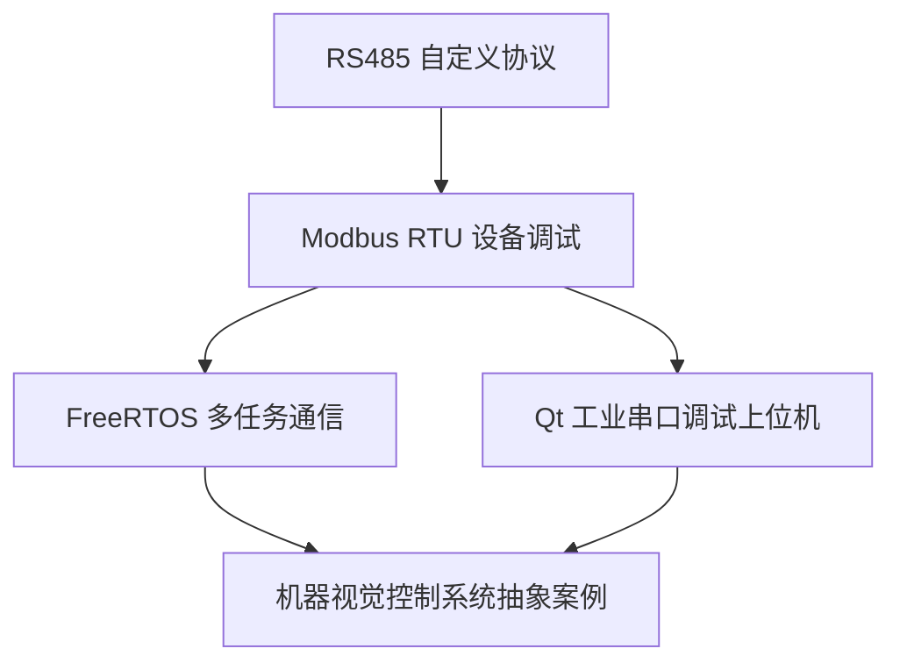

# 项目实战索引

这个目录用于把前面学过的单片机、嵌入式 C、RS485、Modbus RTU、FreeRTOS、Qt 上位机和求职表达串成项目闭环。

初学者不要一开始就追求“大而全”的项目。更好的方式是：先做一个能跑通、能解释、能保存日志的小项目，再逐步增加协议、任务拆分、上位机和复盘文档。

所有项目都只使用公开、抽象、可复现的学习场景。涉及真实控制卡、驱动器、传感器、端子定义、接线和设备寄存器时，必须以数据手册、原理图和实测结果为准，不能凭经验编造，也不能泄露真实公司或客户项目资料。

## 推荐完成顺序

| 顺序 | 项目 | 难度 | 前置知识 | 最终能沉淀的能力 |
|---|---|---|---|---|
| 1 | `01_RS485自定义协议通信项目.md` | 入门 | USART、RS485、缓冲区 | 能讲清串口收发、帧尾判断、主循环处理完整帧 |
| 2 | `02_Modbus_RTU设备调试项目.md` | 核心 | RS485、CRC16、Modbus RTU | 能做一个可展示的协议调试闭环 |
| 3 | `03_FreeRTOS多任务通信项目.md` | 进阶 | 任务、队列、信号量 | 能把裸机通信程序拆成多任务结构 |
| 4 | `04_Qt工业串口调试上位机.md` | 进阶 | Qt、QSerialPort、日志 | 能用上位机完成串口联调和数据展示 |
| 5 | `05_机器视觉控制系统项目抽象案例.md` | 综合 | 通信、控制流程、上位机 | 能用抽象场景说明工业控制系统的软件链路 |

## 项目之间的关系



你可以把 `02_Modbus_RTU设备调试项目.md` 当成本目录的旗舰项目。它既能连接 RS485、CRC、功能码、异常响应，也能连接 Qt 上位机和 FreeRTOS 任务拆分，适合作为简历中的主项目来讲。

## 每个项目建议准备的材料

| 材料 | 作用 |
|---|---|
| 项目目标 | 说明你要解决什么问题 |
| 软件结构 | 说明模块如何拆分 |
| 通信流程 | 说明数据从哪里来、到哪里去 |
| 代码片段 | 证明你不是只会讲概念 |
| 测试用例 | 证明你知道如何验证 |
| 调试日志 | 证明你能定位问题 |
| 面试讲法 | 把工程过程转成口头表达 |
| 简历写法 | 把项目边界写真实、写具体 |

## 面试展示建议

面试时不要同时讲 5 个项目。建议选择 1 个主项目，加 1 到 2 个辅助项目。

推荐组合：

- 主项目：Modbus RTU 设备调试项目。
- 辅助项目 1：Qt 工业串口调试上位机。
- 辅助项目 2：FreeRTOS 多任务通信项目。

这样你可以形成一条完整表达：

```text
我先用裸机串口和 RS485 跑通通信，
再实现 Modbus RTU 的 03/06 功能码和 CRC 校验，
然后用 Qt 上位机做 TX/RX 日志和寄存器显示，
最后思考如何把通信、解析、控制和日志拆成 FreeRTOS 任务。
```

这比只说“我做过串口通信”更有工程感，也更容易经得住追问。

## 简历表达总模板

> 基于个人嵌入式学习项目，完成 RS485/Modbus RTU 通信链路设计与调试，支持自定义协议帧接收、Modbus 03/06 功能码解析、CRC16 校验、模拟寄存器读写、Qt 上位机日志显示和 FreeRTOS 多任务拆分思路，能够结合 TX/RX 原始帧、测试用例和调试日志说明问题定位过程。

这段模板只是参考。写简历时要删掉自己没有实际完成的部分，只保留能展示代码、日志或文档证据的内容。
